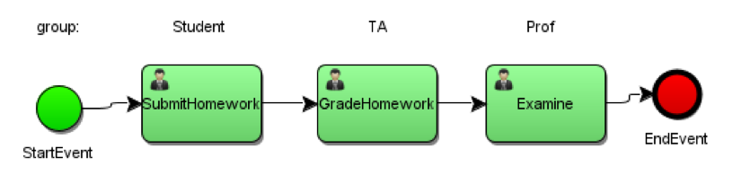
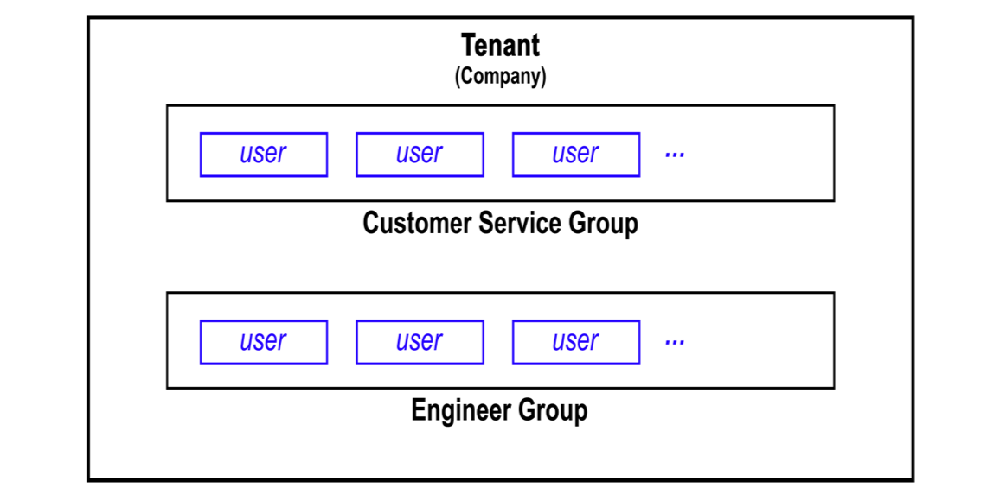
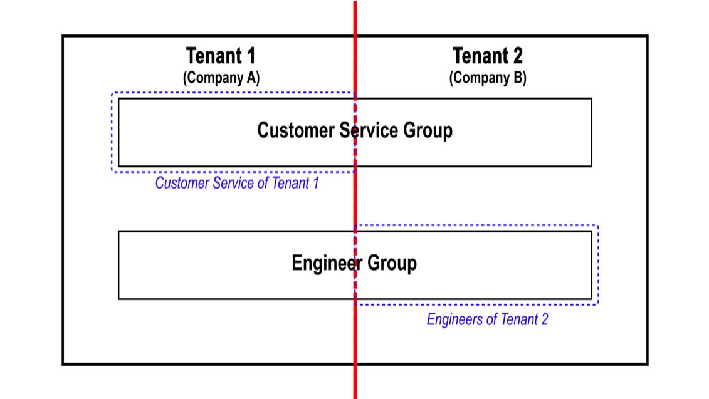

# Multiple Tenancy Support of Business Process Management Platform

UM-SJTU Joint Institute VE450 Major Design Experience (MDE) project.

## Objective

- Implement multiple tenancy support for an open source business process management engine Activiti.

- Novelty: Isolation and Sharing

## BPM

- Business process management

- Standard of notation: 

  - Business Process Modeling Notation (BPMN)

  - BPMN 2.0

    
## Activiti

- A BPM engine

- Usually used by a single tenant

  - Internal/embedded system for one company

    
## Multiple Tenancy

## Expected Deliverables

- Build a wrapper to extend original APIs in Activiti engine to support multiple tenants.

- Define Activiti flow process using a home renovation as a sample.

- Build sample web application platform which enables multiple tenants and remains data & flow isolation.